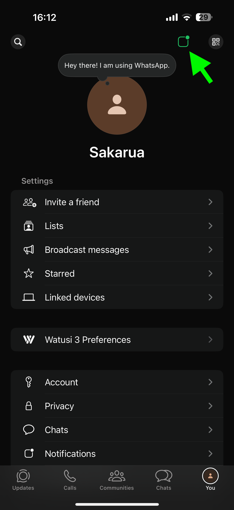
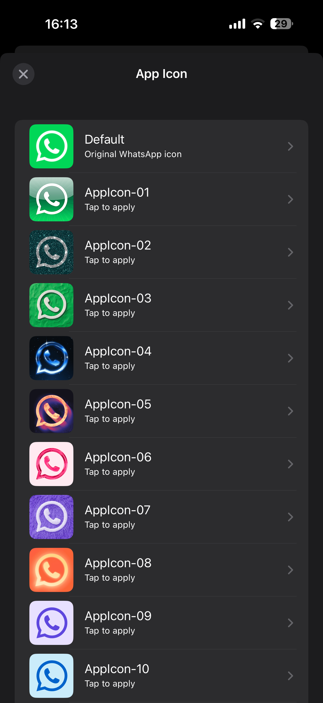

# WAIconPicker

A lightweight jailbreak tweak that adds an icon picker inside WhatsApp settings, allowing you to switch between all available alternate app icons directly in-app.

---

## Features

- Add icon picker button inside WhatsApp settings
- Switch between all bundled alternate icons
- Live preview of icons in a clean list
- Lightweight and fast (no hooks into core logic)
- Native UIKit design

---

## Preview

  
  

---

## Usage

1. Open WhatsApp  
2. Go to Settings  
3. Tap the icon button (top-right)  
4. Select any icon you want  

---

## Notes

- Uses iOS native setAlternateIconName
- Icons must already exist inside the app bundle
- No respring required

---

## Credits

- Developed by mikasa-san

---

## License

MIT License